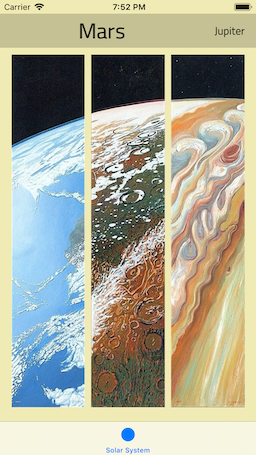

# GSSlidingSelector

`GSSlidingSelector` is a controller for selecting a small fixed amount of elements with swipe gestures.

*Inspired by [Figure](https://itunes.apple.com/us/app/figure-make-music-beats/id511269223) app*

## Example

| Appetize Live Demo | Gif |
| --- |--- |
| [Tap to play on Appetize](https://appetize.io/app/5uv9qzk6n1z6qut4f82x5rht80?device=iphonexsmax&scale=75&orientation=portrait&osVersion=12.1&deviceColor=black) | [Gif Example](assets/example.gif) |

The example projects are located under `GSSlidingSelectorExample` and `GSSlidingSelectorExampleSwift` folders.

## Usage

Select an appropriate guide:

|  |  |
| --- | --- |
| [UsageObjC.md](UsageSwift.md) | [UsageSwift.md](UsageObjC.md) |

## License

1. `GSSlidingSelector` is released under the MIT license. See [LICENSE](https://github.com/galarius/GSSlidingSelector/blob/master/LICENSE) for details.

2. Images of planets surfaces are provided on the terms of personal, non commercial use by `bytecodeminer` from [alphacoders.com](https://wall.alphacoders.com/big.php?i=725422).

3. Application icon is provided on the terms of `Creative Commons (Attribution 3.0 Unported)` license from [iconfinder.com](https://www.iconfinder.com/icons/2119346/scientific_solar_system_icon)