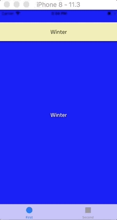

# GSSlideSelector

[](https://github.com/galarius/GSSlideSelector/blob/master/LICENSE)


Controller for selecting items with swipe gestures.



## Usage

1. Add folder `GSSlideSelector` to your project.

2. In your `UIViewController` import `GSSlideSelectorViewController.h`:

    ```objc
    #import "GSSlideSelectorViewController.h"
    ```

3. Extend your interface like this:

    ```objc
    @interface SomeViewController () <GSSlideSelectorDelegate>

    @property (strong, nonatomic) GSSlideSelectorViewController *selector;
    @property (strong, nonatomic) NSArray *items;

    @end
    ```

4. In `- (void)viewDidLoad` add the following:

    ```objc
    - (void)viewDidLoad
    {
        [super viewDidLoad];
        // Do any additional setup after loading the view, typically from a nib.
        
        _items = @[@"Item 1", @"Item 2", @"Item 3", @"Item 4"];
        _selector = [[GSSlideSelectorViewController alloc] init];
        self.selector.delegate = self;
        [self addChildViewController:self.selector];
        [self.view addSubview:self.selector.view];
        [self.selector didMoveToParentViewController:self];
        // ...
    }
    ```

5. Set the frame:

    ```objc
    - (void)viewWillLayoutSubviews
    {
        [super viewWillLayoutSubviews];
        
        self.selector.view.frame = CGRectMake(0, 40, CGRectGetWidth(self.view.frame), 60);
    }
    ```

6. Implement `GSSlideSelectorDelegate` protocol methods:

    ```objc
    #pragma mark - GSSlideSelectorDelegate

    - (NSUInteger)numberOfItemsInSlideSelector:(GSSlideSelectorViewController*)selector
    {
        return self.items.count;
    }

    - (NSString *)slideSelector:(GSSlideSelectorViewController*)selector titleForItemAtIndex:(NSUInteger)index
    {
        return [self.items objectAtIndex:index];
    }

    - (void)slideSelector:(GSSlideSelectorViewController*)selector didSelectItemAtIndex:(NSUInteger)index
    {
        NSLog(@"Selected item at index: %lu (%@)", (unsigned long)index, [self.items objectAtIndex:index]);
        // Do something depending on selected item ...
    }
    ```

## License

> GSSlideSelector is released under the MIT license. See [LICENSE](https://github.com/galarius/GSSlideSelector/blob/master/LICENSE) for details.